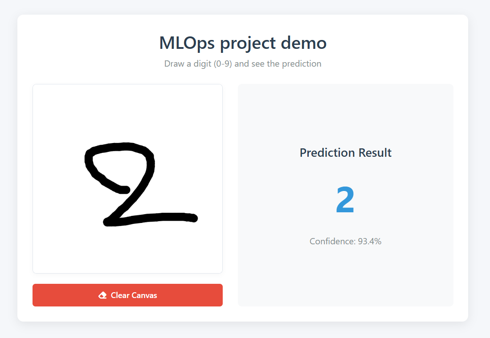
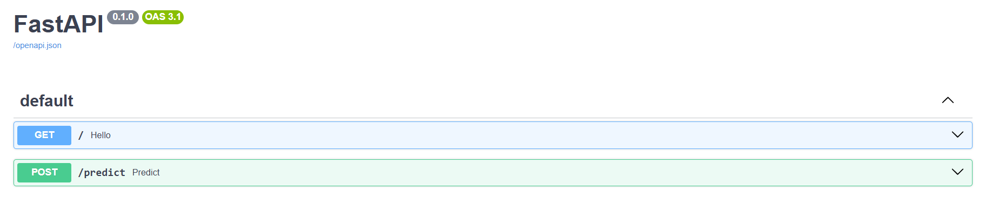
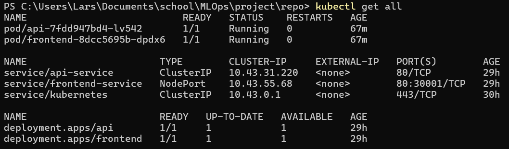

# MLOps Project Report
## GitHub Repositories
- [Main repository](https://github.com/LarsMws/mlops-project) (current)
- [Azure ML resource repository](https://github.com/sadiksha99/Mlops_project_Azure_ML)


## Project Overview

Our project focuses on deploying a handwritten digit classification model trained on the MNIST dataset. The model is a CNN that predicts a digit from a 28x28 grayscale pixel input. The model is initially trained and versioned via Azure ML and later integrated into the project with the help of github actions and polling scripts.

- Dataset: MNIST (handwritten digit images)
- Model: CNN architecture using TensorFlow/Keras


## Task 1: Cloud AI Services
### Dataset 
- mnist dataset 2, 7, 8 all of them around 1450 images of png

-  


### Preprocessing
This script takes a folder full of .png images and prepares them for training a simple AI model. It goes through each image, removes any transparency, shrinks it down to 28 by 28 pixels, and saves it as a .jpg file in a new folder. This makes the images ready to be used in models like those that recognize handwritten digits


### train-testsplit
This script takes one or more folders of .jpg images (each folder representing a different digit), mixes the images randomly, and splits them into training and testing sets based on the percentage you give (we have used 80 training and 20 as usual). It then saves the images into new folders containing the label name. 


## Components and pipelines
First made indiviudal components and pipelines and then downloaded it and did the whole pipeline process and automation through cli.

### Individual components, pipeline and successful jobs 
convert_resize_images


mnist_data_split


mnist_training


Training ephos and confusion matrix and accuracy
Did 20 ephocs


High accuracy as you can see in the front in that it can recognize very good the numbers.

### full pipeline
components


Working pipeline


### Github Actions
## Task 3.1 – Automatically retrain the model
First, a Service Principal account was created and its credentials were added to the GitHub repository as a secret (AZURE_CREDENTIALS).

The model is retrained automatically whenever the source code is updated on the main branch.

The GitHub Actions workflow sets up the environment, components, and compute automatically.

If the compute already exists or is running, this is detected to avoid duplication (continues on error if it is running cause ml azuere gives error for this can stop the action incompleted).

If the compute is stopped, it is started; otherwise, it continues as-is.

The compute start step uses continue-on-error to ensure the pipeline proceeds even if starting fails.

Compute resources are shut down automatically by Azure after use.


## Task 3.2 – Automatically deploy the new model
After training, the model is automatically registered in Azure ML.

The latest model version is downloaded and packaged as a ZIP file.

The model is published as a versioned GitHub Release for easy access.

The entire process runs fully automatically with minimal manual steps after pushing to GitHub.

Every push and change to the code creates a new release of model with the number prefix at the end automatically generated.


## Task 2: Frontend, FastAPI and Deployment
### Frontend

The Docker image for the frontend is packaged directly together with nginx. Alternatively we could've configured this in Kubernetes instead, but this would've slightly increased the complexity. We just kept it simple for the demo since it doesn't require load balancing etc.



The frontend also has both a `config.js` and `config.prod.js` file. This currently just handles the different routing for the development and production environment, but could be easily expanded if needed. When a docker build is triggered, the production config overwrites the default development config before building the image.

### FastAPI

We used FastAPI to pass model predictions to the frontend based on pixel values as an array (grayscaled and flattened).



Example usage:
```
POST /predict
{
  "pixels": [0, 0, 74, ..., 255]  // length 784
}
```

The api Docker image contains both the api and the prediction model itself. This ensures that the api works out of the box when pulling from Dockerhub.

### Kubernetes deployment
When there's a push to the `main` branch, a pipeline is triggered which automatically build the Docker images and pushes them to Dockerhub. After this, a new job is executed on a self-hosted github runner, which pulls the new images and rolls them out using `kubectl`. It would've been easier to only host the images locally, but since it's a group project it seemed more favorable for us both to have access to the latest images at all times.

All Kubernetes configs are available under `./kubernetes/`



### Microservice communication/availability
- Frontend: `NodePort`
- Api: `ClusterIP`

Since we're only using a single endpoint and the API doesn't have to be available by other apps/services, we just added a proxy-pass to nginx config for this endpoint. This way, the frontend client can still send requests to the required endpoint without having to expose the whole api. The api itself is only available within the cluster.


## Task 3: Automation & CI/CD
### Azure ML
> TODO: training and github releases (Sadiksha)
> hier ook best bespreken van versioning

### Frontend & API
When something is pushed to the `main` branch of this repository, a workflow triggers which builds the Docker images for the frontend and api, and then pushes them to Dockerhub. Consecutively, a job gets executed on a self-hosted github runner which rolls out the new images to kubernetes.

We used a `rolling` deployment strategy to ensure that the old pods remain available while the new ones are still being created. `Green-blue` and `canary` deployment seemed overkill because we have neither load balancing or a user base.

### Model deployment
This would've been easier/better to do by calling a webhook in the Azure ML workflow, but this implementation was somewhat last minute and I didn't have write access to the Azure repository at the time. As an alternative, I wrote a polling script which periodically checks if the Azure repository has a new release (every 15 minutes). There's a bash script available at `./automation/install_cron.sh` which automatically registers the polling script to your cron jobs.

Once the polling script detects a new release, it automatically downloads said release, replaces the old model in the repository with the new one, then commits and pushes exclusively the changes within `./api/models/`.

Once the new release is pushed to the repository, all other deployment steps are handled automatically by the previous pipeline.


## Reflection
### Things that went well
> TODO (Sadiksha)

### Problems we ran into
We originally planned to use a persistent volume for the model and mount this to the api's deployment. This way, we could've updated the model locally (using a github runner) without having to rebuild the api's Docker image. It also seemed more logical to keep the model separate from the rest of the codebase, so we wouldn't run into synchronization issues. Unfortunately, we ran into a problem with the file mounts which we couldn't seem to figure out. For some reason, the k8s distribution from Docker Desktop tried to resolve the given `hostPath` on some random debian distro (not docker-desktop), which didn't have access to the host's filesystem. When debugging, we did notice that `/mnt/host/c/` was added before the given path internally, which would be the correct file path for the docker-desktop distro. For this reason, we used an alternative strategy as described above.


### What we learned
- Learned that we should use a linux VM for Docker in the future
> TODO (Sadiksha)
