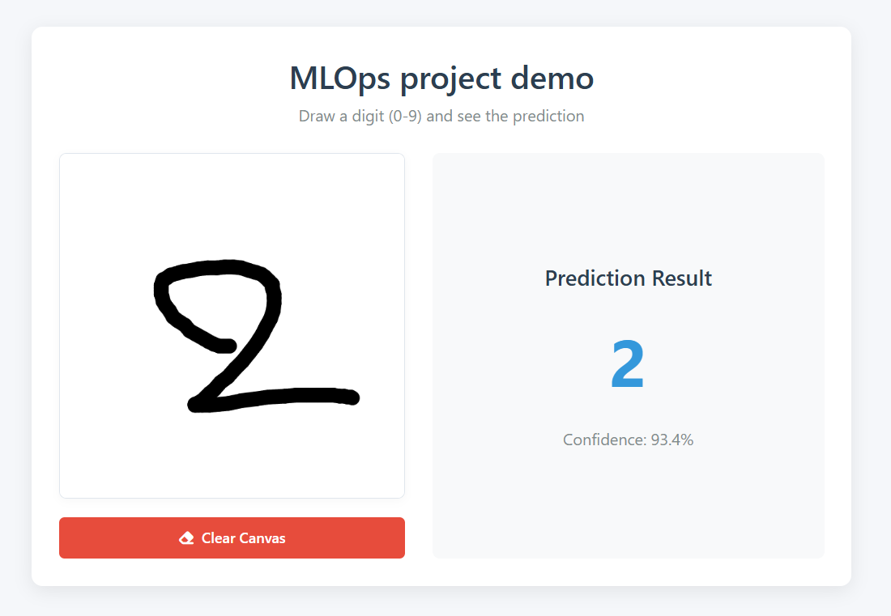
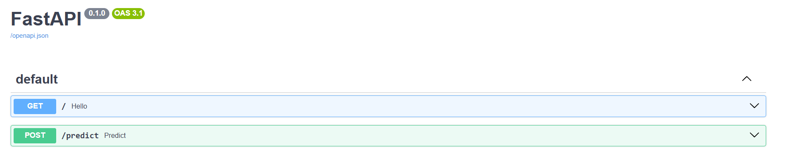
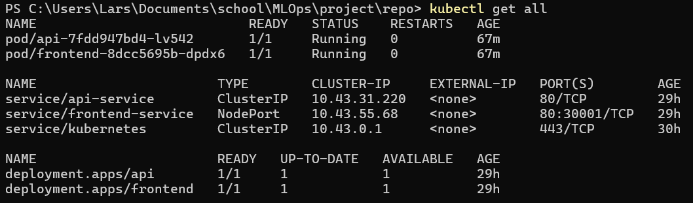

# MLOps Project Report
## GitHub Repositories
- [Main repository](https://github.com/YOUR_USERNAME/YOUR_REPO_NAME]) (current)
- [Azure ML resource repository](https://github.com/sadiksha99/Mlops_project_Azure_ML)


## Project Overview

Our project focuses on deploying a handwritten digit classification model trained on the MNIST dataset. The model is a CNN that predicts a digit from a 28x28 grayscale pixel input. The model is initially trained and versioned via Azure ML and later integrated into the project with the help of github actions and polling scripts.

- Dataset: MNIST (handwritten digit images)
- Model: CNN architecture using TensorFlow/Keras


## Task 1: Cloud AI Services
TODO


## Task 2: Frontend, FastAPI and Deployment
### Frontend

The Docker image for the frontend is packaged directly together with nginx. Alternatively we could've configured this in Kubernetes instead, but this would've slightly increased the complexity. We just kept it simple for the demo since it doesn't require load balancing etc.



The frontend also has both a `config.js` and `config.prod.js` file. This currently just handles the different routing for the development and production environment, but could be easily expanded if needed. When a docker build is triggered, the production config overwrites the default development config before building the image.

### FastAPI

We used FastAPI to pass model predictions to the frontend based on pixel values as an array (grayscaled and flattened).



Example usage:
```json
POST /predict
{
  "pixels": [0, 0, 74, ..., 255]  // length 784
}
```

The api Docker image contains both the api and the prediction model itself. This ensures that the api works out of the box when pulling from Dockerhub.

### Kubernetes deployment
When there's a push to the `main` branch, a pipeline is triggered which automatically build the Docker images and pushes them to Dockerhub. After this, a new job is executed on a self-hosted github runner, which pulls the new images and rolls them out using `kubectl`. It would've been easier to only host the images locally, but since it's a group project it seemed more favorable for us both to have access to the latest images at all times.

All Kubernetes configs are available under `./kubernetes/`



### Microservice communication/availability
- Frontend: `NodePort`
- Api: `ClusterIP`

Since we're only using a single endpoint and the API doesn't have to be available by other apps/services, we just added a proxy-pass to nginx config for this endpoint. This way, the frontend client can still send requests to the required endpoint without having to expose the whole api. The api itself is only available within the cluster.


## Task 3: Automation & CI/CD
